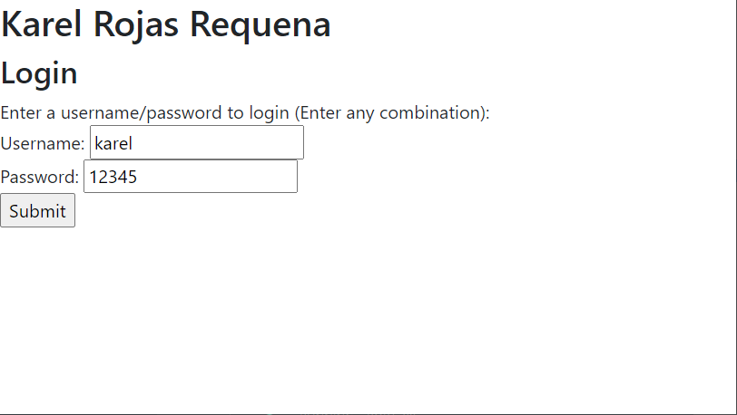
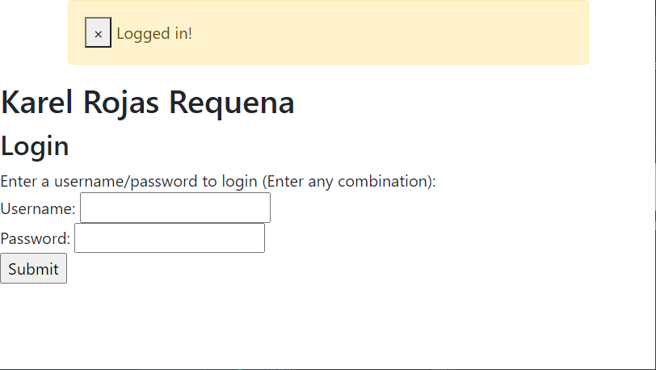

# Nginx Flash Message and Validation
There are two pages in this repo, `index.html` and `subsect.html`. The pseudo-login
information is on the `subsect.html` page, so if you are running an nginx server, the
link would be `localhost/subsect` or something similar.

Here is a preview of a flash message appear as a result of a form submission.

Before submission:

After submission:
